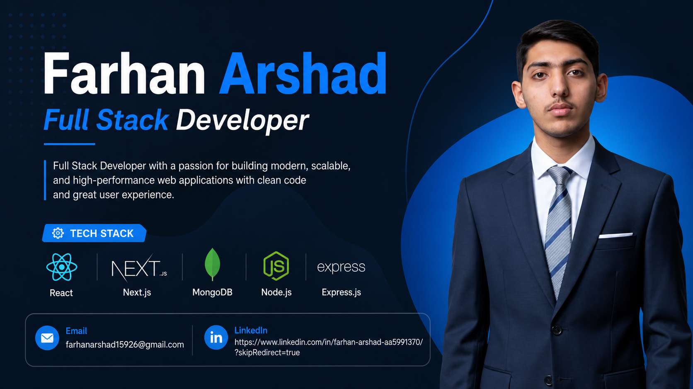

# Farhan-Arshad

  

   <b>Hi, I'm Farhan Arshad!</b> 
   <b>MERN Stack Developer</b> building scalable, performant, and full-stack web applications. 
   Passionate about turning complex problems into clean, efficient code and seamless user experiences. 
   <b>Tech Stack:</b> MongoDB | Express.js | React.js | Node.js | JavaScript | Python

  

## 🤝 Connect With Me

  
  
  

